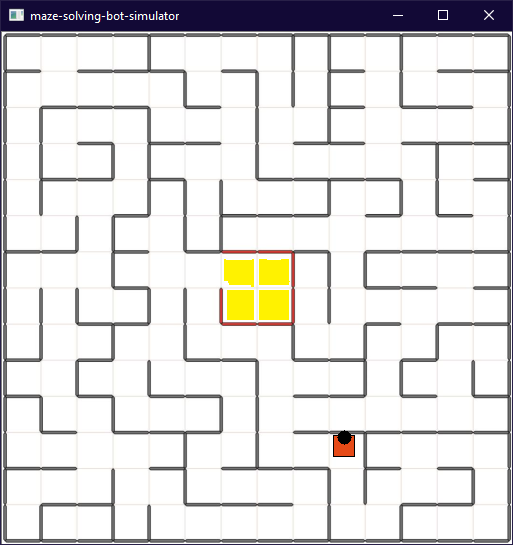

# python-projects

## maze-solving-bot-simulator

Small bot to simulate and test maze solving algorithms before designing the robot.

### Prerequisites

- python 3
- open-cv
- numpy

### How to run

Run `main.py` using python 3. Exit by continuously pressing `Esc` several times.

### Changing map and other settings

You can change map by changing `maze.png` image. Add a thick black line to denote a wall. Use deep yellow color to denote floor color changes. All light colors and thin black lines will be ignored.

Furthermore you can change basic settings to change bot position, facing direction,... by changing settings variable values. These can be found in `bot_scripts.py` at the end of file.

| Variable Name             | Default Value    | Description                                                  |
| ------------------------- | ---------------- | ------------------------------------------------------------ |
| `settingsImagePath`       | `"Maze.png"`     | Image map to load.                                           |
| `settingsStartX`          | `1`              | Starting X coordinate(column) of the bot. Can be a value between 1 and `settingsFaceDirection` (inclusive). |
| `settingsStartY`          | `1`              | Starting Y coordinate(row) of the bot. Can be a value between 1 and `settingsFaceDirection` (inclusive). |
| `settingsFaceDirection`   | `Direction.EAST` | Direction that bot is facing in the beginning. Can be one of `Direction.EAST`, `Direction.WEST`, `Direction.SOUTH` and `Direction.NORTH`. |
| `settingsGridSideSquares` | `14`             | Number of squares per one side in the grid. If `settingsGridSideSquares` is 14, grid has to be a 14x14  grid. |
| `settingsSrcClass`       | `DFS`            | Class Name to load to the bot                                |

### Add a custom class

Define user script in `bot_scripts.py`.

All `userscripts` must,

- include a `setup()` and `loop(img)` function
- include a `__init__()` method which takes `bot` parameter
- Should NOT include any methods which affects the value of `bot` in `__init__()`
- `loop` must accept one variable as `img`, but try not to change `img` value. If you change it change it in-place. Can use `img` to tasks such as refreshing window

Furthermore,

- `setup` will run only once at the simulation initialization
- `loop` will run each time screen is updated(by default)
- You can force screen refresh by `util.refreshScreen()`, however note that additional `loop()` functions will not run at these forced refreshes
- If `loop()` returns `STOP_SIMULATION` value, simulation will stop.
- Call `cv2.destroyAllWindows()` to close current window. However if not `STOP_SIMULATION` is issued, new refresh will cause a new window to load.
- Use `cv2.waitKey(0)` to wait for a `KeyPress`. Indicate a time to wait by `cv2.waitKey(TIME_TO_WAIT)` where `TIME_TO_WAIT` denotes milliseconds.

Since bot has no way of knowing some values in real world,

- Try not to use bot functions rather than basic movement and sensor
- Try not to use bot position variables such as `bot._x`, `bot._direction`
- It is OK to access `bot.side` because it is known in most situations
- Try not to use settings values

Use only these bot values and functions. When implementing the algorithm in `Arduino` or some equivalent, these are the variables/function you have to implement. Implementing rest will be fairly easy.

| Variable/Function    | Description                                                  |
| -------------------- | ------------------------------------------------------------ |
| `bot.side`           | Side length of one grid cell.                                |
| `bot.turnRight()`    | Turns bot 90' right.                                         |
| `bot.turnLeft()`     | Turns bot 90' left.                                          |
| `bot.goForward()`    | Goes one cell forward.                                       |
| `bot.frontSensor()`  | Get distance to closest object in front.                     |
| `bot.rightSensor()`  | Get distance to closest object in right side.                |
| `bot.leftSensor()`   | Get distance to closest object in left side.                 |
| `bot.groundSensor()` | Get whether ground color is different. Currently tuned to yellow color. |

.

### Screenshot

### Current Implementation

Uses `DepthFirst Search` to traverse the whole grid and remember the graph. Then uses `Breadth First Search` and `Dynamic Programming` when finding shortest distance.
